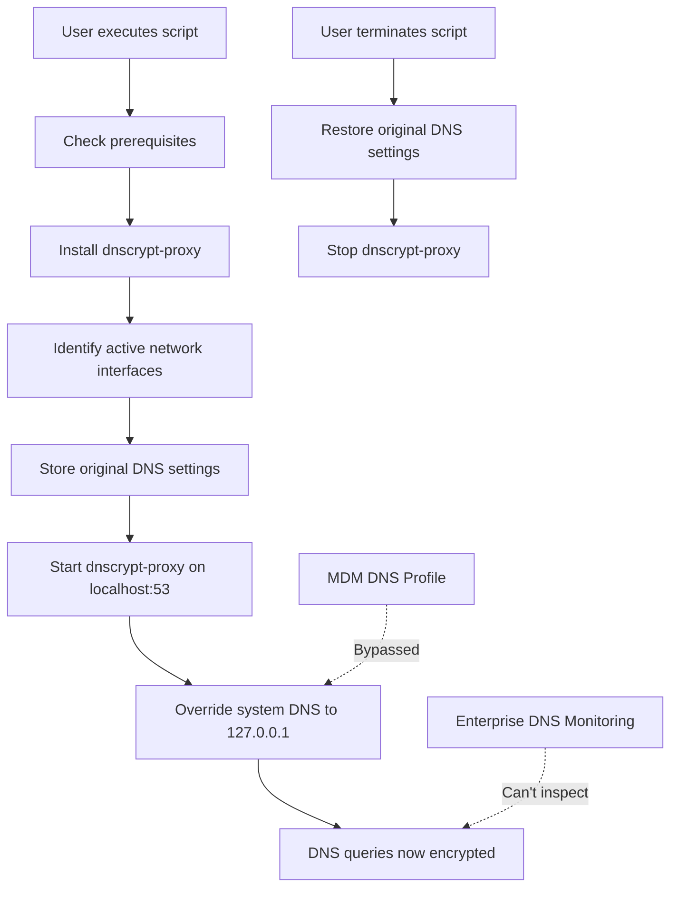

# DNS Override Tool

## Overview

This tool provides a method to override DNS settings on macOS systems using dnscrypt-proxy, enabling encrypted DNS queries that bypass standard DNS monitoring and filtering mechanisms. The script automatically installs dnscrypt-proxy, detects active network interfaces, and configures them to use the local DNS proxy.

## How It Works



The script works by:

1. **Installing dnscrypt-proxy**: Downloads and configures a local DNS proxy that encrypts DNS queries
2. **Detecting active interfaces**: Identifies all network interfaces with active connections
3. **Storing original settings**: Preserves the original DNS configuration for restoration later
4. **Overriding DNS settings**: Changes all active interfaces to use 127.0.0.1 (localhost) for DNS
5. **Signal handling**: Properly restores settings when the script is terminated

## Visual Demonstration


Comparison showing DNS configuration now and before running the script.

`top:` DNS queries are now resolved locally, where dnscrypt-proxy encrypts them before forwarding to external resolvers, ensuring the Domain Names can be resolved securely.

`bottom:` DNS queries are blocked while routed through the Enterprise Cloud security product suite.

## Bypassing Enterprise DNS Controls

This tool can effectively bypass several enterprise security controls:

### MDM Profile Evasion

Mobile Device Management (MDM) profiles often enforce specific DNS servers to ensure traffic filtering and monitoring. This script overrides these settings at the system level, redirecting DNS queries to the local dnscrypt-proxy instance instead of the MDM-enforced servers.

### Enterprise Proxy and DNS Sinkhole Evasion

Enterprise networks commonly use DNS filtering, monitoring, and sinkholing to:
- Block access to malicious or unauthorized domains
- Monitor DNS queries for security analysis
- Enforce acceptable use policies

By encrypting DNS queries through dnscrypt-proxy, this tool prevents enterprise security tools from:
- Inspecting the content of DNS queries
- Blocking requests to unauthorized domains
- Logging DNS activity for security monitoring
- Enforcing DNS-based security policies

The encrypted DNS traffic appears as regular HTTPS traffic, making it difficult to distinguish from normal web browsing.

## Usage

```bash
# Run the script (requires sudo)
sudo ./dns_override.sh

# View help information
sudo ./dns_override.sh --help

# Display version information
sudo ./dns_override.sh --version

# Revert DNS changes
sudo ./dns_override.sh --revert
```

## Security Implications for Organizations

### Monitoring Recommendations

Organizations should consider implementing the following security measures:

1. **Monitor localhost:53 (TCP/UDP)**: Detect unauthorized DNS proxies running locally
2. **Inspect encrypted DNS traffic**: Look for patterns consistent with DoH (DNS over HTTPS) or DoT (DNS over TLS)
3. **Block outbound DNS encryption protocols**: Consider blocking access to known DoH/DoT providers
4. **Implement egress filtering**: Restrict outbound DNS to authorized servers only
5. **Deploy DNS security monitoring**: Look for unusual DNS patterns that might indicate covert channels

### Potential for Malicious Use

Encrypted DNS can be misused for:
- **Command and Control (C2) communications**: Malware can use encrypted DNS as a covert channel
- **Data exfiltration**: Sensitive data can be encoded in DNS queries and responses
- **Policy evasion**: Users can access blocked content by bypassing DNS-based filtering

### MAC (Mandatory Access Control) Mitigations

If users have local admin privileges, organizations can still implement MAC solutions to mitigate these risks:

1. **System Extension Blocking**: Prevent unauthorized system extensions that modify network settings
2. **Application Control**: Restrict which applications can be installed and executed
3. **Network Extension Frameworks**: Control which processes can modify network configurations
4. **Endpoint Detection and Response (EDR)**: Monitor for suspicious process activity related to DNS configuration changes
5. **TCC (Transparency, Consent, and Control) Profiles**: Limit applications' ability to modify system settings

## Disclaimer

**IMPORTANT**: This tool is provided for **educational purposes only**. The author does not encourage or condone:
- Bypassing organizational security controls
- Violating acceptable use policies
- Circumventing network security measures
- Any unauthorized use of computing resources

Using this tool may violate your organization's security policies and could result in disciplinary action. Security professionals should use this information to better understand potential evasion techniques and implement appropriate countermeasures.

## Legal Considerations

In many jurisdictions, bypassing security controls may violate:
- Computer misuse laws
- Employment agreements
- Acceptable use policies
- Data protection regulations

Always obtain proper authorization before testing or deploying security tools in any environment.
